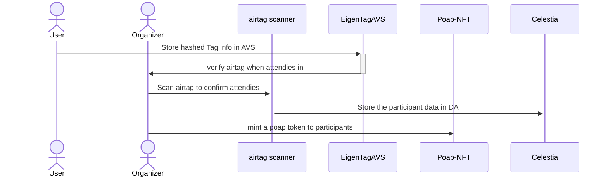

<div align="center">
<h1>Hashirama</h1>
<p>An innovative project leverages Apple AirTag technology to create a secure and efficient method for verifying event participation.</p>

</img>

[](./LICENSE)
</div>

### Demo Page
- Website: [https://hashirama.pages.dev](https://hashirama.pages.dev)
- Contract:
  + 

### Abstract
By utilizing the public key of AirTags, we've developed a system that provides irrefutable proof of attendance at various events, from conferences to concerts and beyond. Never more scan the QRCode

Store tag info (hashed public tag) and use mac to scan all tag in event every 15 mins, it will make the event organizer.

### Key Features

Secure Verification: Each participant's AirTag public key serves as a unique digital signature.

AVS Data Verify: Store the airtag data(now only hashed public key) in AVS. And this info can be the data which can mint poap for participants.

### How It Works

Participants bring their AirTag to the event.
Our system scans and records the AirTag's public key upon entry.The public key is associated with the specific event in our AVS Service.Post-event, participants can prove their attendance by presenting their AirTag.


Integration with blockchain for immutable attendance records. This record in celestia, it's cheap and can easy get from everyone.

### Hashimaru Components

Hashimaru consists of three main components:

1. **Hashimaru Reward Token**:
   Hashimaru is a NFT like poap

2. **Hashimaru Airtag AVS**:
    Store user hashed airtag public key,  this is a random and will change in apple rule

3. **Hashimaru paricipant data**:
    Every scan from organizer will publish to DA. And make this to a proof that people will know this guy stay and contribute in this event more.
   

### Build & Installation
| Hashimaru is a monorepo managed using `turbo`. You can find the source code for each package in the `apps` and `packages` directory.
- apps
  + `apps/web` is the web frontend. It built by frontend template, `wagmi` and `vite`
  + `apps/findapp`: use findmy to find everyone's airtag
- `packages`
  + `packages/contract` : eigen contract & token
  + `packages/celestia-provider` : celetia nft store backend
  + `packages/eigen-operator` : interactive with avs
### Step By Step
1. Install all peer dependencies
```bash
pnpm install
```

2. Build only frontend
```bash
pnpm build --filter web
```

3. Deploy Contract
```bash
cd packages/contract
pnpm deploy:token --networks <YOUR_NETWORK>
pnpm deploy:miner --networks <YOUR_NETWORK>
```

### Sequence Diagram

| Use case: use airtag to confirm participant


